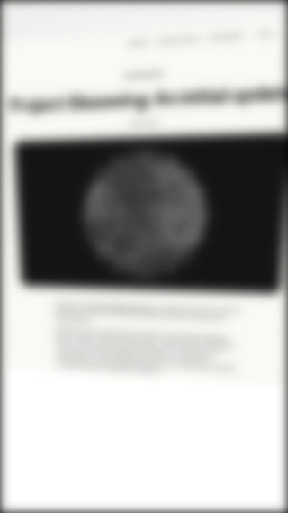
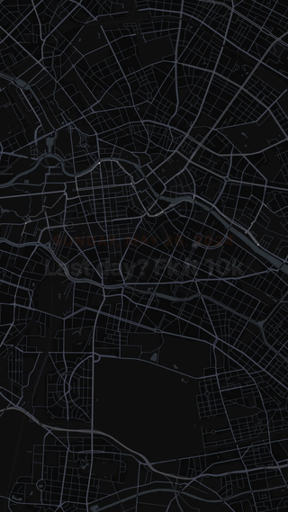

# remotion

Three Remotion compositions for generating short-form video b-roll. Built for 9:16 (Instagram Story / Reels / TikTok).

## Compositions

<table>
<tr>
<td align="center"><b>ArticleHighlight</b></td>
<td align="center"><b>TravelMap</b></td>
<td align="center"><b>RunStory</b></td>
</tr>
<tr>
<td></td>
<td></td>
<td></td>
</tr>
<tr>
<td>Article screenshot with rough.js marker highlights, blur focus-pull intro, and slow 3D perspective rotation. Uses <code>mix-blend-mode: multiply</code> so highlights appear behind the text.</td>
<td>Great-circle flight path between two cities on a Stadia watercolor map. Camera follows the route head, zooms into the destination, then pulls back to outline the surrounding region.</td>
<td>Converts a Strava/Garmin GPX file into a 15-second story. MapLibre dark map with the route drawing in real time, overlaid with live metrics synced to actual GPS timestamps.</td>
</tr>
</table>

---

## Setup

```bash
pnpm install
cp .env.example .env   # add your Stadia key for TravelMap
pnpm start             # open Studio at localhost:3000
```

## Assets (not in repo — provide your own)

| File | Used by |
|---|---|
| `public/screenshot.png` | ArticleHighlight — screenshot of any article |
| `public/Afternoon_Run.gpx` | RunStory — Strava or Garmin GPX export |

## Render

```bash
npx remotion render ArticleHighlight out/article.mp4
npx remotion render TravelMap out/travelmap.mp4 --gl=angle --concurrency=1
npx remotion render RunStory out/run.mp4 --gl=angle --concurrency=1
```

`--gl=angle` is required for the MapLibre compositions (WebGL). `--concurrency=1` prevents map tile race conditions.

## Regenerating with Claude Code

See [`PROMPTS.md`](./PROMPTS.md) — each composition has a self-contained prompt you can paste into Claude Code to regenerate or extend it.

## Stack

- [Remotion](https://remotion.dev) 4.x
- [MapLibre GL JS](https://maplibre.org) — map rendering
- [CARTO Dark Matter](https://carto.com/basemaps) — no-auth map tiles for RunStory
- [Stadia Maps](https://stadiamaps.com) — watercolor tiles for TravelMap (free tier)
- [Turf.js](https://turfjs.org) — geospatial math
- [rough.js](https://roughjs.com) — hand-drawn highlight style
